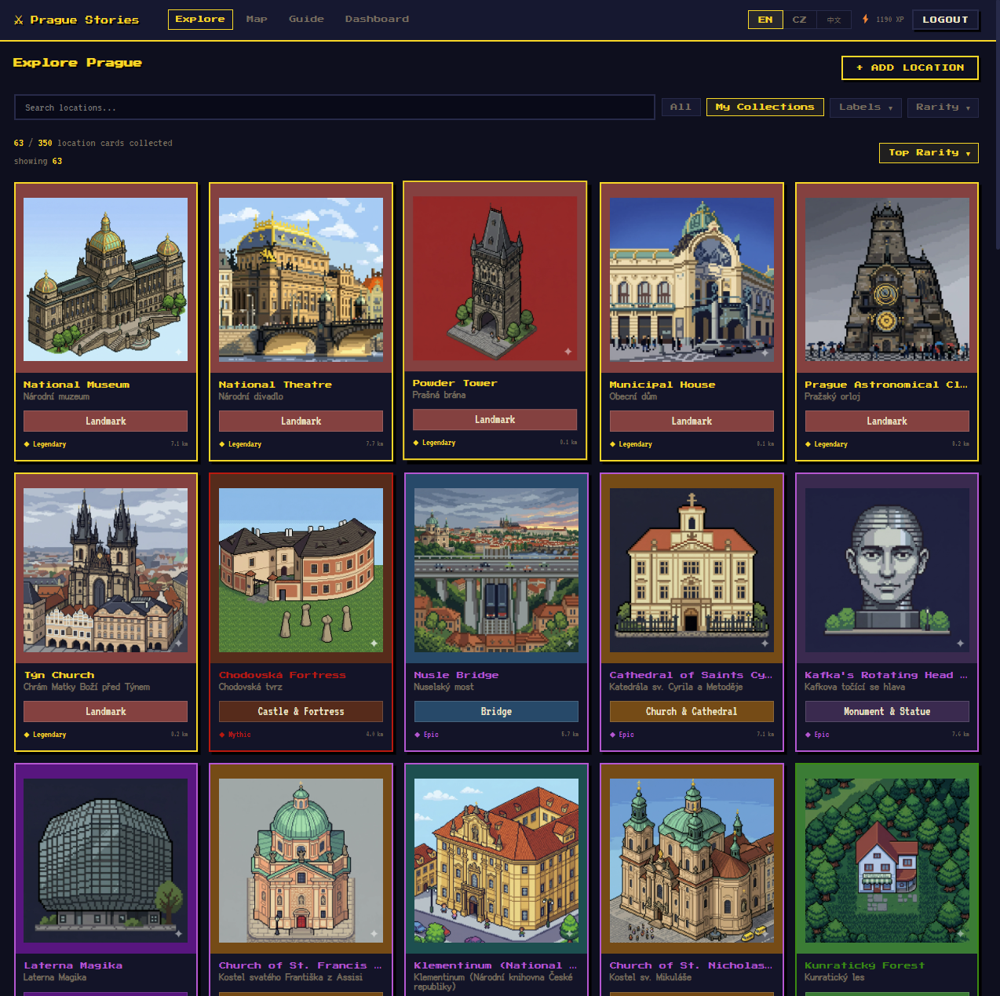
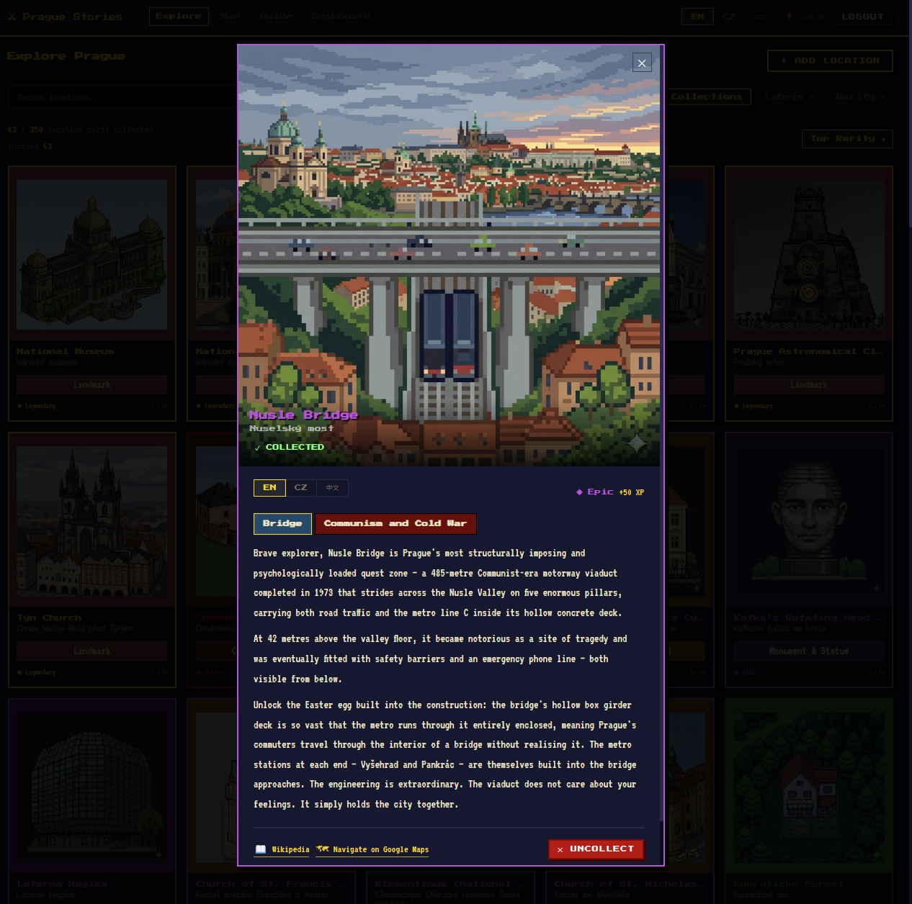
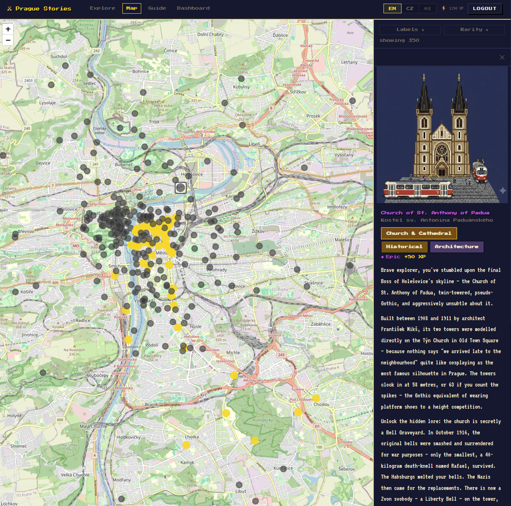
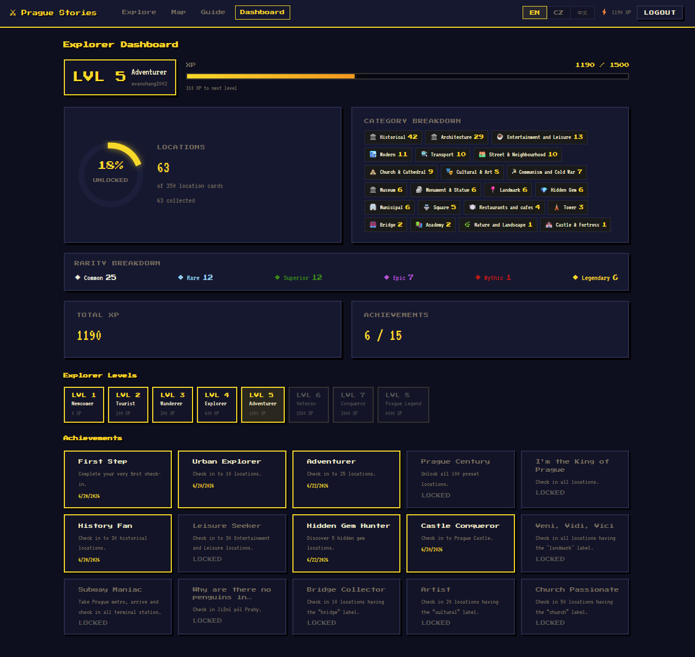
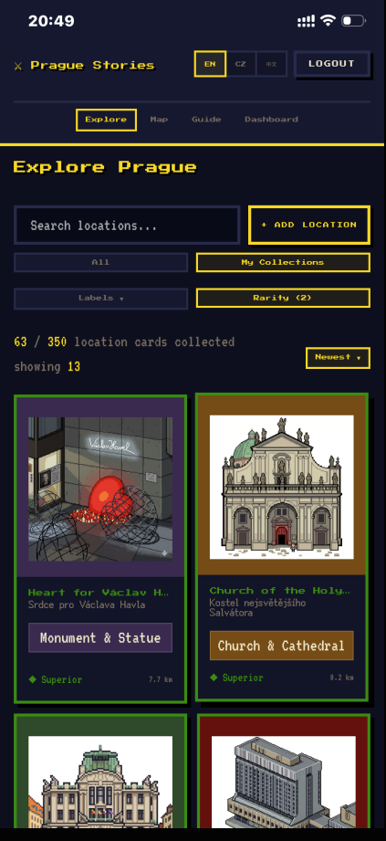

# Prague Stories

A gamified city-exploration app for Prague — built on the MERN stack and deployable as a PWA.

Discover hundreds of Prague landmarks, earn XP, level up, unlock achievements, and read trilingual descriptions in English, Czech, and Chinese(CN/TW). Go there. Stand there. The app notices.

**Live Demo:** https://prague-stories.vercel.app

## Stack

| Layer    | Tech                                                      |
| -------- | --------------------------------------------------------- |
| Frontend | React 18 + Vite, React Router v6, Leaflet / react-leaflet |
| Backend  | Node.js + Express (ES modules)                            |
| Database | MongoDB + Mongoose                                        |
| Auth     | JWT (jsonwebtoken + bcryptjs)                             |
| AI       | Google Gemini API (descriptions + pixel art)              |
| Images   | Cloudinary (production) + local WebP (dev)                |
| CSS      | Custom pixel-art design system, mobile-first              |

---

## Screenshots

| Explore Grid | Location Detail |
|---|---|
|  |  |

| Map View | Dashboard |
|---|---|
|  |  |

| Installed PWA | |
|---|---|
|  | |

---

## Key Features

### Exploration & Collection

- **300+ preset Prague locations** spanning every district and era — castles, cemeteries, Baroque churches, Cold War bunkers, a psychiatric hospital that hosts music festivals, and a confluence of two rivers that almost nobody visits
- **GPS-verified check-in** — the server validates you are within 200 m of the location (distance check skipped in `development` mode for local testing)
- **Automatic proximity detection** — a gold banner rises from the bottom of the screen when you walk within 100 m of an unvisited location; tap to collect
- **Instant grid refresh** after check-in; modal auto-closes after 2.5 s with XP and achievement summary
- **Undo check-in** (Uncollect) available on any collected card

### Guest Mode

- Unauthenticated visitors who follow a direct link are **automatically placed into guest mode** — no redirect to `/login`
- Guests can browse the full explore grid, map, guide, and read all location details
- Collect, add, and edit require a registered account

### Rarity System

Six tiers modelled on trading-card games, visible on every card border and diamond — even for locked cards:

| Tier      | Colour          | XP   | Who finds these                |
| --------- | --------------- | ---- | ------------------------------ |
| Common    | grey            | +10  | Anyone passing through         |
| Rare      | blue            | +20  | Smart tourists                 |
| Superior  | green `#2c8c03` | +30  | Curious visitors               |
| Epic      | purple          | +50  | Locals and enthusiasts         |
| Mythic    | orange          | +70  | Dedicated hunters              |
| Legendary | gold            | +100 | Prague's most iconic landmarks |

### Explore Grid

- Filter by **label** (stackable — e.g. Church + Hidden Gem simultaneously) or **rarity tier**
- Sort by **Distance** (closest first, default), **Newest** (recently added), or **Top Rarity**
- Live distance shown on each card ("340 m", "1.2 km")
- **My Collections** tab to review only unlocked cards
- Czech original name shown as a subtitle under the EN/ZH display name

### Interactive Map

- Leaflet map with gold (collected) and grey (locked) markers
- Sidebar shows square pixel art banner + "View Detail" button opening the full location modal
- Rarity filter available in the sidebar

### Gamification

**8 Explorer Levels** (XP thresholds):

| Level | Title         | XP    |
| ----- | ------------- | ----- |
| 1     | Newcomer      | 0     |
| 2     | Tourist       | 100   |
| 3     | Wanderer      | 300   |
| 4     | Explorer      | 600   |
| 5     | Adventurer    | 1 000 |
| 6     | Veteran       | 1 500 |
| 7     | Conqueror     | 3 000 |
| 8     | Prague Legend | 6 000 |

**15 Achievements** unlocked automatically at milestones:

| Achievement                   | Condition                            |
| ----------------------------- | ------------------------------------ |
| First Step                    | First check-in                       |
| Urban Explorer                | 10 check-ins                         |
| Adventurer                    | 25 check-ins                         |
| Prague Century                | 100 preset locations collected       |
| I'm the King of Prague        | Every location collected             |
| History Fan                   | 30 historical locations              |
| Leisure Seeker                | 30 parks + restaurants/cafés         |
| Hidden Gem Hunter             | 10 hidden gem locations              |
| Castle Conqueror              | Check in to Prague Castle            |
| Veni, Vidi, Vici              | All landmark locations               |
| Subway Maniac                 | All 6 Prague metro terminal stations |
| Why Are There No Penguins...? | Find Jižní pól Prahy                 |
| Bridge Collector              | 10 bridge locations                  |
| Artist                        | 20 cultural locations                |
| Church Passionate             | 50 church locations                  |

### Location Cards

- **Trilingual descriptions** (EN / CZ / ZH) — handwritten long-form storytelling with historical depth, local humour, and 🥚 Easter eggs baked into selected cards
- **AI-generated pixel art** (Gemini) served as lossy WebP — one illustration per location
- **Lazy AI fallback** — if a description is missing, Gemini generates it on first detail view and saves it to the DB
- Wikipedia link and Google Maps navigation on every card
- Custom locations can be added by registered users with cover photo upload (JPEG/PNG/WebP → auto-converted to WebP via sharp → stored on Cloudinary)

### Localisation

Full UI in **English, Czech, and Chinese** — toggled via EN / CZ / ZH buttons in the navbar. All interface strings, label names, and location names switch accordingly.

In Chinese mode the UI switches to **[Ark Pixel Font (方舟像素字体)](https://github.com/TakWolf/ark-pixel-font)** — a CJK-compatible pixel typeface loaded from self-hosted woff2 files. Apple PingFang SC is the immediate fallback for mobile.

A **繁 / 简 toggle** appears when ZH is active, converting the entire UI (including DB description text) between Simplified and Traditional Chinese via [opencc-js](https://github.com/nk2028/opencc-js). The converter initialises lazily and the preference persists in `localStorage`.

### PWA

Installable as a standalone app on iOS and Android:

- **iPhone** — Safari → Share → Add to Home Screen
- **Android** — Chrome → ⋮ → Add to Home Screen
- Runs full-screen with no browser UI; tap the logo to force a version refresh (useful when there's no browser refresh button)

---

## Getting Started

### Prerequisites

- Node.js 18+
- MongoDB (local or Atlas URI)
- [Google Gemini API key](https://aistudio.google.com/)
- Cloudinary account (for cover photo uploads in production)

### Setup

```bash
# 1. Install dependencies
cd server && npm install
cd ../client && npm install

# 2. Configure environment
cp server/.env.example server/.env
# Fill in MONGO_URI, JWT_SECRET, GEMINI_API_KEY, CLOUDINARY_* (see below)

# 3. Seed locations
cd server && node src/data/seedLocations.js

# 4. Start the backend (port 5000)
npm run dev

# 5. Start the frontend (port 5173) — new terminal
cd ../client && npm run dev
```

Open `http://localhost:5173`, register an account, and start exploring.

> **Note:** GPS distance validation is skipped in `development` mode — you can test check-ins locally without being in Prague.

---

## Project Structure

```
prague-stories/
├── client/                    # React + Vite frontend
│   ├── public/
│   │   ├── fonts/             # Ark Pixel Font (woff2 subsets, self-hosted)
│   │   └── pixel-art/         # Generated WebP illustrations
│   └── src/
│       ├── components/
│       │   ├── shared/        # Navbar, ProtectedRoute, ProximityPrompt, Toast
│       │   ├── locations/     # LocationCard, LocationGrid, LocationDetail,
│       │   │                  #   AddLocationForm, EditLocationForm, LabelEditorModal
│       │   ├── map/           # MapView (Leaflet)
│       │   └── dashboard/     # ProgressRing, AchievementBadge
│       ├── context/           # AuthContext (JWT + guest mode), LanguageContext (i18n + opencc)
│       ├── hooks/             # useProximityDetection, useUserPosition
│       ├── pages/             # Explore, Map, Dashboard, Guide, Login, Register
│       ├── services/          # Axios API layer
│       └── utils/             # pixelArtMap, locName, rarity, geolocation
└── server/                    # Express backend
    └── src/
        ├── models/            # User, Location (localizedNames, description), CheckIn
        ├── routes/            # /api/auth, /api/locations, /api/checkins, /api/user
        ├── controllers/       # authController, locationController, checkinController, userController
        ├── middleware/        # auth (JWT), errorHandler
        ├── services/          # claudeService (Gemini), gamification (levels + achievements)
        └── data/              # seedLocations.js, exportLocations.js, syncCovers.js, rarityMap.js
```

---

## API Reference

| Method | Route                        | Auth     | Description                                                       |
| ------ | ---------------------------- | -------- | ----------------------------------------------------------------- |
| POST   | `/api/auth/register`         | —        | Create account                                                    |
| POST   | `/api/auth/login`            | —        | Returns JWT                                                       |
| GET    | `/api/auth/me`               | ✓        | Verify token, return user                                         |
| GET    | `/api/locations`             | optional | All locations; includes unlock status when authenticated          |
| GET    | `/api/locations/:slug`       | optional | Single location + lazy Gemini description generation              |
| POST   | `/api/locations`             | ✓        | Add custom location                                               |
| PUT    | `/api/locations/:slug`       | ✓        | Update name, coords, labels, descriptions, rarity, localizedNames |
| POST   | `/api/locations/:slug/cover` | ✓        | Upload cover image (→ WebP via sharp → Cloudinary)                |
| DELETE | `/api/locations/:slug`       | ✓        | Delete location (cascades check-ins)                              |
| GET    | `/api/checkins`              | ✓        | User's full check-in history                                      |
| POST   | `/api/checkins/:slug`        | ✓        | Check in: validates GPS, awards XP, evaluates achievements        |
| DELETE | `/api/checkins/:slug`        | ✓        | Undo check-in                                                     |
| GET    | `/api/user/progress`         | ✓        | XP, level, unlock %, category and rarity breakdown                |
| GET    | `/api/user/achievements`     | ✓        | All 15 achievements with unlock status                            |

---

## Data Scripts

| Script               | Command                          | Purpose                                            |
| -------------------- | -------------------------------- | -------------------------------------------------- |
| `seedLocations.js`   | `node src/data/seedLocations.js` | Upsert all seeded location cards into the DB       |
| `exportLocations.js` | `npm run export:locations`       | Export current DB state → static seed files        |
| `syncCovers.js`      | `npm run sync:covers`            | Sync cover images between Cloudinary and local dev |

---

## Testing

Jest unit tests cover all pure-logic utilities. 98 tests across 5 suites — no database, no HTTP server, no React rendering required.

```bash
# Server (42 tests)
cd server && npm test

# Client (56 tests)
cd client && npm test
```

| Suite | What's covered |
| --- | --- |
| `rarityMap` | `RARITY_XP` constants, `getRarity()` slug lookup + unknown-slug default |
| `gamification` | `calculateLevel()` all 8 level thresholds, progress %, multilingual titles; `evaluateAchievements()` every predicate, deduplication |
| `locName` | `getLocName()` null safety, English passthrough, per-language fallback chain |
| `geolocation` | `haversineDistance()` known distances, symmetry; position cache, subscriber fan-out, unsubscribe, stale-cache bypass, navigator error paths |
| `pixelArtMap` | `getArt()` key hits, label fallback, array vs string, default; `LABEL_DEFINITIONS` shape; `LABEL_COLORS` hex format + coverage |
| `rarity` | `RARITY_XP` parity with server, `RARITY_COLOR` hex + spot-checks, `RARITY_LABEL` multilingual coverage |

Server tests use native ESM (`--experimental-vm-modules`). Client tests use Babel transform (`babel-jest`).

---

## Environment Variables

```env
# server/.env
MONGO_URI=mongodb://localhost:27017/prague-stories
JWT_SECRET=your_jwt_secret_here
JWT_EXPIRES_IN=7d
GEMINI_API_KEY=your_gemini_api_key_here
CLOUDINARY_CLOUD_NAME=your_cloud_name
CLOUDINARY_API_KEY=your_cloudinary_api_key
CLOUDINARY_API_SECRET=your_cloudinary_api_secret
CLIENT_ORIGIN=https://your-frontend-domain.vercel.app
PORT=5000
NODE_ENV=development
```

---

## License

MIT
